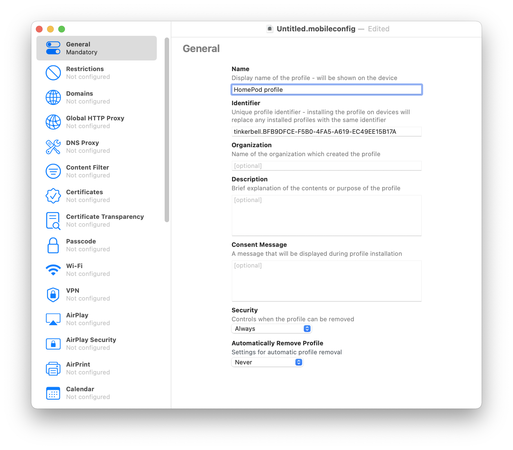
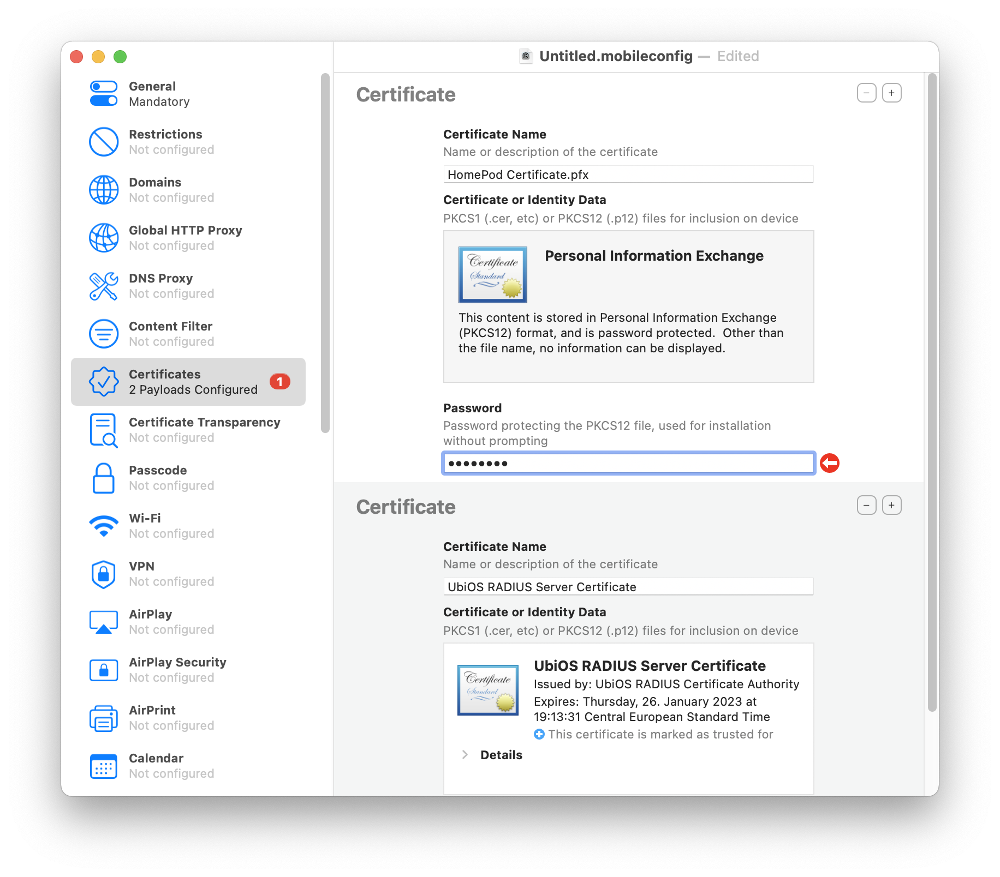
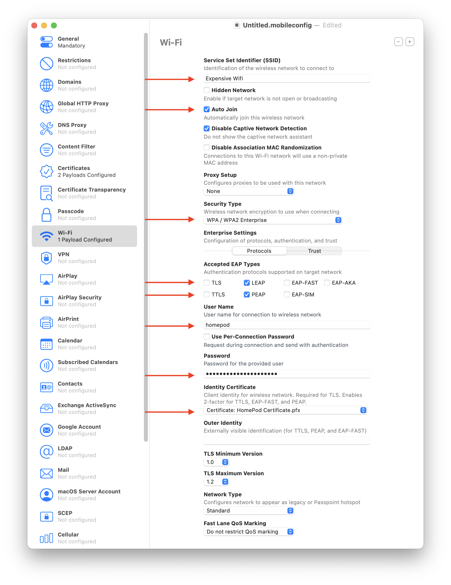
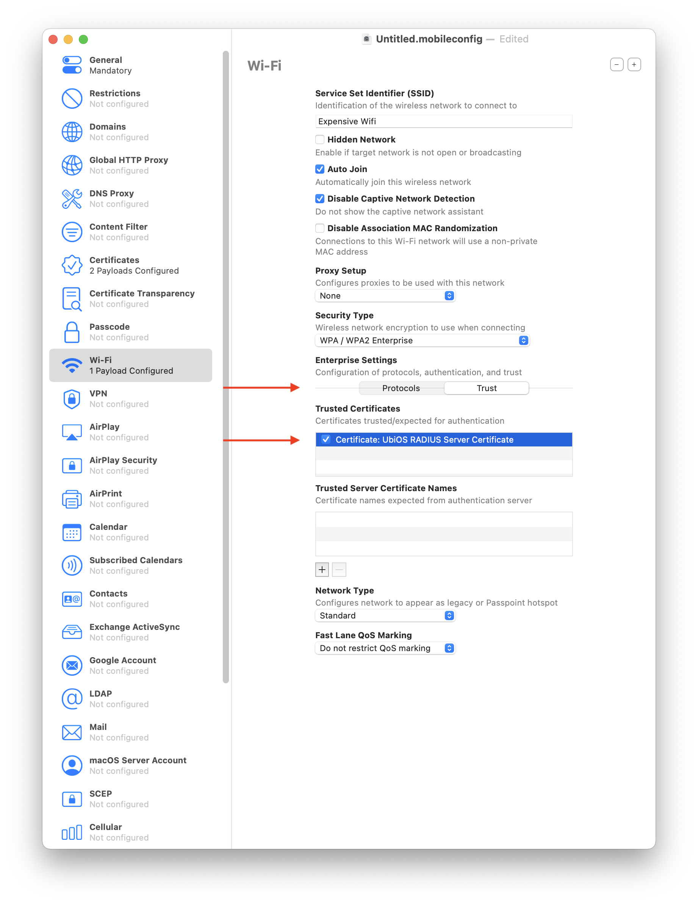
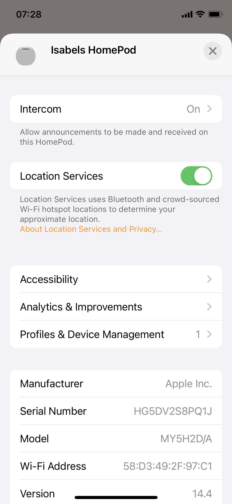
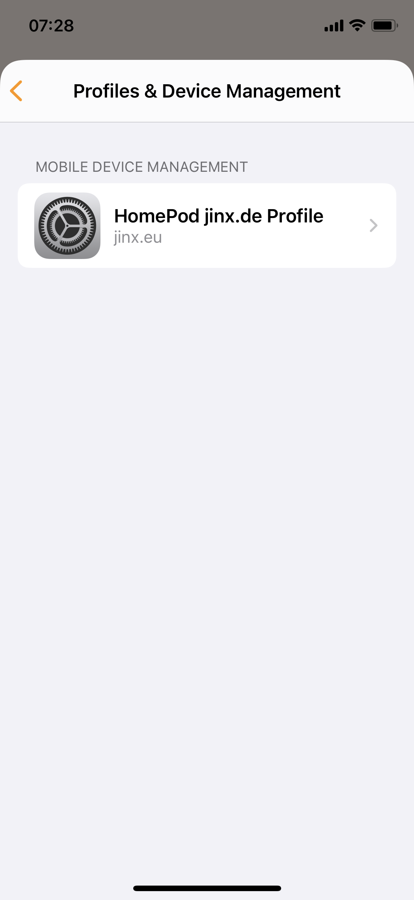

# Apple Mobile profile generation for your Unifi 802.1x EAP network

This guide is a note to myself on how to create a mobile provisioning profile for my Apple Devices ( e.g. HomePod , AppleTV , MacBook , iPhone , etc. ) to automatically connect as correct user to my UniFi EAP network.

## Background

My home network is build with multiple VLANs. Users ( internal, dayguests, night guests ) have their own networks and can communicate freely to each other on the network, as well as they can start communication to the service networks ( tv-network, printer/scanner network, solar network ). 
I have Unifi based network equipemnet and use EAP wifi network access is granted with just username / password. That way my printer, if compromised can't give out anything else but it's network password and an attacker can get only to the service network in which devices can't initiate connections at all.

## HomePod 802.1x problem

Now we got a HomePod mini and that device uses the same login and password as the user of the Phone which is used to setup the HomePod. Problem is, HomePods update their Wifi network password everytime the user switches it's network. So there is no way to setup a HomePod in a service network and it stays there. As soon as the owners iPhone enters the normal user network the HomePod follows.

I've read that HomePods can be supplied with a provisioning profile ( https://support.apple.com/en-us/HT209643 ), but nowhere I found on how to do that. So is there any way to prevent HomePod from changing networks ? Yes, there is, this is what this document is for.

## Solution

### Step 1 create a Client certificate

Currently I have not found a way to get around the need to create certificate which is signed by the radius server, so let's generate that first ( this is what the build.sh does ).

- Get the certificate of the Radius server (on the UDM-Pro they are stored in /mnt/data/udapi-config/raddb/certs )
- Create a certificate signing request for a certificate that the client can use later
- Sign that certificate with the certificates we got from the radius server. 
- Export the certificate so it can be used with [Apples Mobile Configurator application](https://itunes.apple.com/app/apple-configurator-2/id1037126344?mt=12)
- In our case we copy the server.pem certifcate to a file named *Radius Server Certificate.crt* so that Apple Configurator recognizes it as certificate.

Be aware that this process has to be done every time your server certificate changes. Browsers have it that they no longer accept certificates that are valid more than a year, so I presume that restriction applies for our ssl certificate as well, so I'm generating them only for 365 days. 

```bash
#!/bin/bash
#
#update this variables accordingly

udmproaddress=192.168.1.1
country=DE
organisation='My Private Network'
certificatename='HomePod'
password='password'

scp -r root@${udmproaddress}:/mnt/data/udapi-config/raddb/certs certs

cd certs
openssl req -subj "/C=${country}/O=${organisation}/CN=${certificatename}" -out myclient.csr -new -newkey rsa:4096 -nodes -keyout myclient.key
openssl x509 -req -days 365 -in myclient.csr -CA server.pem -CAkey server-key.pem -CAcreateserial -out myclient.crt -sha256
openssl pkcs12 -passout "pass:${password}" -export -in myclient.crt -inkey myclient.key -out ../"${certificatename} Certificate.pfx"
cp server.pem ../"Radius Server Certificate.crt"
```

### Step2 create a mobile provisioning profile

Open up Apple Configurator and use the File->New Profile menu to generate a new profile.

In *General* tab enter a Profile Name: 

 

In *Certificates* add the *Radius Server Certificate.crt* as well as the certificate just generated (e.g. HomePod certificate.pfx) and enter the password there ( password in our case )

 

No go to the *Wi-Fi* tab and enter the following:

- SSID, your wifi name
- enable *Auto Join*
- Set the other settings to your liking
- *Security Type*  *WPA/WPA2 Enterprise* and *WPA2 Enterprise (iOS8 or later.. )* worked for me
- *Protocols* enable LEAP/PEAP and set the username, password and certificate according to your server. Outer Identity seems irrelevant
- *Trust* Trust the radius server certificate

 
 

Now your are all set and can save the provisioning profile in Apple Configuratior.

## Install Provisioning Profile on HomePod

The easiest way to install the certificate is to mail your certificate to yourself and open that certificate in Mail on an iPhone. You can then install it on the HomePod and verify that it worked inside the Home.app application:

 
 


Happy provisioning :-)


